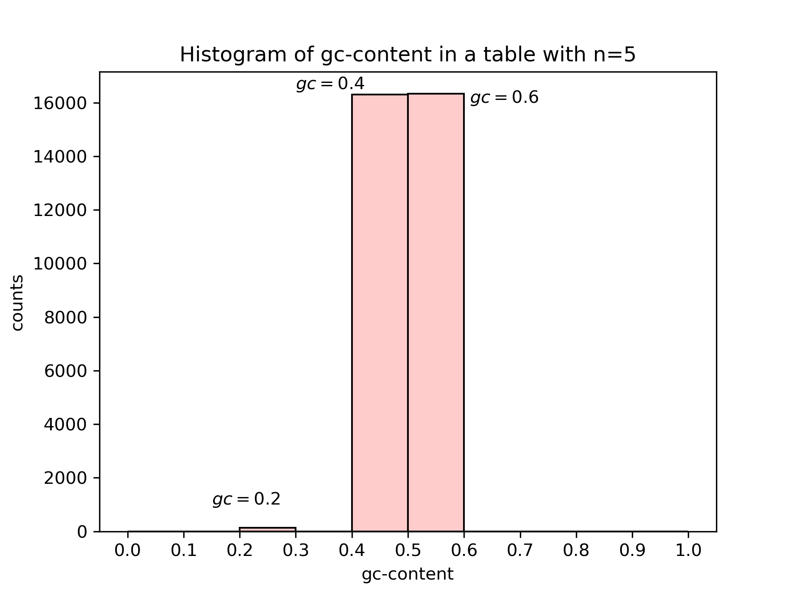
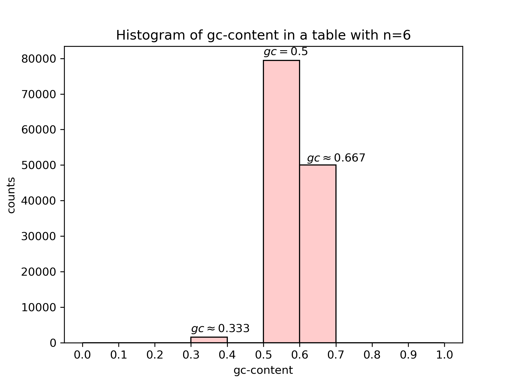
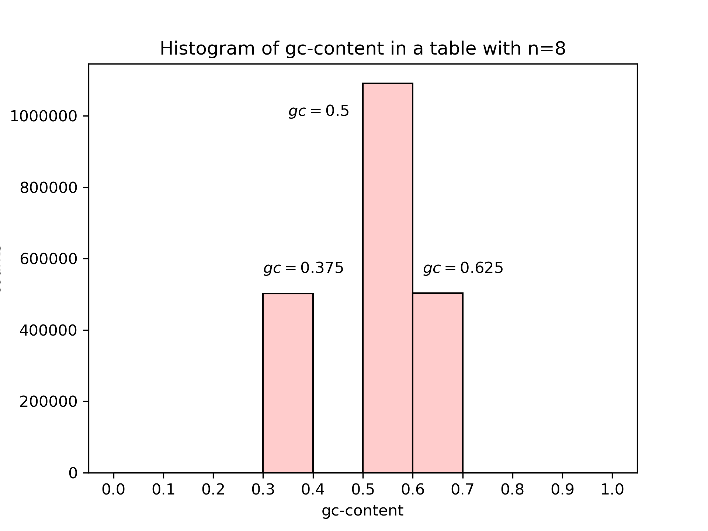
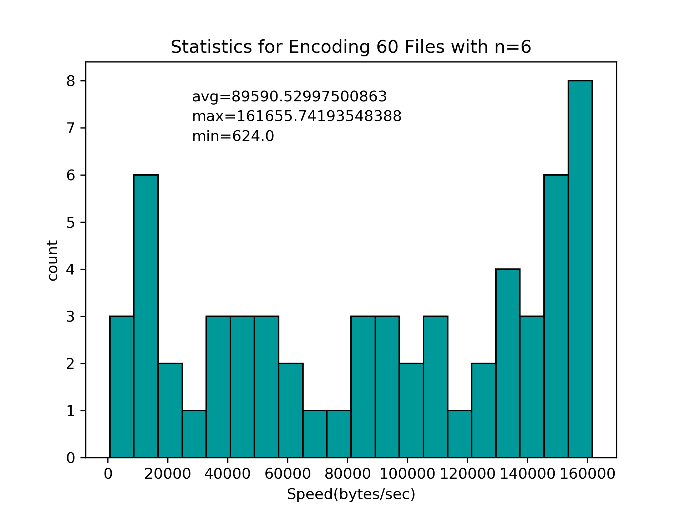
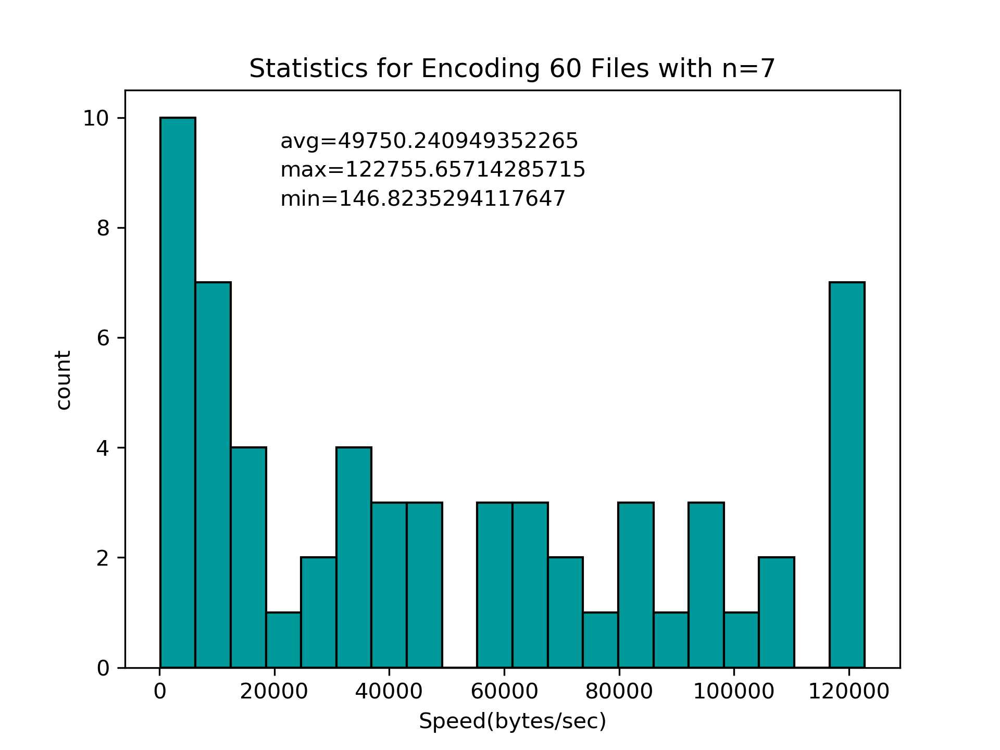

# Implementation of Error-Correcting Codes for DNA Storage

## # Introduction

### 1 Prospect
In the age of information explosion, the speed of information generation grows rapidly. According to the prediction of Internet Data Center(IDC)[6], there will be 460 billion GB data created per day. The increase of information is challenging the existing storage device. Thus, we need to create a new storage-medium with higher capacity of data. DNA has high storage density, only 1 kilogram can store the data around the world. Besides, DNA’s structure is stable in ordinary temperature, which means it can store data in the long term without any other power like electricity. This characteristic of DNA make it a useful material of data storage.

### 2 Process
The process of DNA storage is encoding binary information into 4 bases of DNA, A, T, C, G. Then synthesis the bases into DNA to store data and use sequencing of DNA to read data.

    

### 3 Constraints
However, DNA storage has some constraints. First of all, the DNA synthesis is slow and expensive, it will take thousands of dollars and days of time to just store several MB data. After that, the stable structure of DNA based on its constraints on GC content and run-length, which means the DNA must have G and C bases between 40% and 60% and the number of continuous identical base can not be larger than 3. More over, there are some extra errors when encoding data into DNA, such as insertion and deletion. Therefore, there is a need of specific error correcting code for DNA storage. At last, since we can only synthesize DNA in short segment, it is hard to randomly access the data after encoding it into DNA. This constraint on DNA storage still need to be solved.

### 4 Existing Works
Until now, there are some achievements all over the world in the area of DNA storage. In 1998, researchers of Harvard university first encoded binary code of a picture into DNA. This is the first time that DNA was proved to be a storage-medium of non-biological information. After that, professor Church[1] of Harvard university successfully stored 650KB data into DNA, which is thousands of times larger than previous work. A year later, European Bioinformatics Institute(EMBL) translate 20 MB data into DNA. After that, Yazdi et al.[3]have created the first DNA-based storage architecture that enables random access of data blocks and rewriting of information stored at arbitrary locations within the blocks. Further more, Erlich and Zielinski[2] use LT code to realize DNA fountain, which enables an efficient DNA storage architecture and its speed is 100 times faster than Church’s method. In 2018, W.song et al. came up a method of encoding data into DNA while satisfying the constraints on GC content and run length[5]. As DNA gradually recognized as a future storage material, the number of research on DNA storage is increasing. Microsoft and University of Washington stored 200MB data into DNA in 2016[4]. Recently, they even created a fully automated system of DNA storage, but the cost of time and money still can not be reduced. On account of the efforts of researchers, the methods of DNA storage are continuously improving.

In this article, we will talk about the main constraints on DNA storage: run length and GC content. Then, the topic will focus on the efficient LT code and DNA fountain. At last, the error-correcting code of DNA storage will be discussed.

---

## # GC-Content and Run-Length Constraint

### 1 Method Overview
Not to make things too complex at the very beginning, it is reasonable to first consider only GC-content and run-length constraints since these two are mentioned and considered by most other studies.

Wentu Song et al. have come up with a method that can (only) satisfy these two constraints and can theoretically reach the highest code rate of $\frac{2n-1}{2n}$ [5]. The main idea of this method is staright forward. It simply tries to enumerate  elements in $Z_{4}^{n}$ that satisfies run-length constraint with as less as possiable GC-content distance. GC-content distance is defined as the absolute value of the difference between GC-content and 0.5. By enumerating in this way, it is expected that at least $2^{2n-1}$ elements can be found such that all the elements in $Z_{2}^{2n-1}$ can be mapped to a subset of $Z_{4}^{n}$, which actually generates an encoding table.

It is shown in [5] that if $3 \le n \le 35$, at least $2^{2n-1}$ elements that satisfy run-length constraint (with preceding three nucleotides) can be found in $Z_{4}^{n}$. And according to the demonstration in [5], there is no element violating GC-content constraint for $n=8$ and $n=10$.

### 2 Encoding Details
Since $n$ should satisfy $3 \le n \le 35$. Hence, the encoding scheme must encode the original data into many short segments which are no longer than 35. Recap that DNA synthesis procedure can generate oligos of 200 nt long. So the run-length validity of an encoded segment should be verified together with preceding three nucleotides and each of the 64 possibilities of preceding three nucleotides will independently have an encoding function.

To generate the encoding table, i.e., the encoding function, the first step is to find a set, say $S$, of all elements that satisfy run-length constraint in $Z_{4}^{n}$. The second step is to find a subset of $S$, say $G$, containing $2^{2n-1}$ elements with least GC-content distance. The decoding table can be generated by reversing the encoding table. 

To encode a message, we first use arbitrary one of the 64 encoding table to encode the first segment. Then for each segment to encode, we choose the encoding funtion according to the previous three encoded nucleotides and use it to encode this segment.

To decode a message, we use the same function for encoding the first segment to decode the first encoded segment. The remaining procedure is similar to that of encoding.

### 3 Implementation and Test
To find the $2^{2n-1}$ elements with least GC-content distance, a priority queue can be used to store all the elements that satisfy run-length constraint and then desired $2^{2n-1}$ elements can be directly extracted from the priority queue. 

To store the reversed table, i.e., the decoding function, a hashmap and binary search are both availiable. For binary search, the time comlexity is $O(\log_2(2^{2n-1})) = O(n)$ which is actually $O(1)$ since $3 \le n \le 35$.

Hence, the expected time comlexity for encoding and decoding $m$ segments are both $O(m)$. The most time consuming operation is constructing the encoding table since at least $2^{2n-1}$ elements need to be checked, which leads to a complexity of $O(2^n)$ for both time and space. However, the good news is that, the table need only to be constructed once.

Due to the space and time limit, we only performed test on $n = 5, 6, 7, 8$. The test mainly includes three parts. The first part is the gc-content statistic of tables with different $n$. The second part is the gc-content statistic of the encoding result of 60 files with different $n$. The third part shows the encoding speed of these 60 files with different $n$.

 Although some elements in the encoding table may not satisfy the constraint as shown in *Part 1*, the encoding result in *Part 2* shows that the gc-contents in all cases falls into [0.4, 0.6], which can satisfy the constraint. In *Part 3*, we found that the encoding speed is slow with only tens of kilobytes per second on average. And the speed can vary in a wide range from hundreds of bytes per second to hundreds of kilobytes per second. We also found that the encoding speed decreases as $n$ increases. It requires further test to explain the result in *Part 3*.

* **Part 1 Table GC-Content Test**

    
    
    
    

* **Part 2 Encoding GC-Content Test**

    
    
    
    

* **Part 3 Encoding Speed Test**

    
    
    
    

---
## Implement a DNA storage encoding way based on DNA Fountain.(Including Error-Correcting Codes)

### 1 Over view of DNA fountain 

DNA fountain is a strategy for DNA storage which has strong robustness against data corruption. It could overcome both oligo dropouts and biochemical constraints of DNA storage. The encode process including the step. First, transform the binary file we want to encode  into a group of non- overlapping segments of certain length. Second, Using Luby Transform(LT code) to package data into short messages which called droplets. The droplet contains a data part that include our useful information and a fixed-length seed. The seed is used by Luby Transform to  get the droplet and let the decoder algorithm to identities the segments in the droplet. We iterate Luby Transform to create a single droplet.  Then we screening the droplet. In this stage the algorithm translates the binary droplets to a DNA sequence and screen the oligo sequence which satisfied the  GC content and homopolymer runs. Keep iterating over the droplet creation and screening steps until we get a sufficient number of valid oligos which could use for decoding.

### 2 Details of Luby Transform(LT code)

LT code is a kind of  erasure correcting codes which can be used to transmit digital data reliably on an erasure channel. The encoding algorithm can produce an infinite number of message packets so that it is rateless.

### 3 LT Encoding

Dividing the uncoded message into n blocks of equal length segments. Then using pseudorandom number generator to generate a random number of degree d. (1 ≤ *d* ≤ *n* ) Degree represents the number of block we choose to do XOR operation.

The number of d packets are selected by discrete uniform distribution in the n group of blocks.  Next,  do XOR  between d packets. One result packet would be obtained. The result packet should be transform after add some extra message including how many blocks are there in the whole message (n)  and which d blocks were done the XOR operation.

Repeating these steps until the receiver determines that the message has been fully received and successfully decoded. 

### 4 LT Decoding 

Exclusive(XOR) are also used in the decoding process to retrieve the encoded message.  
 
 ---

##  Future Plan

### 1 LT Code

Implement another DNA storage encoding way based on DNA Fountain. (Including Error-Correcting Codes). 

Adding some Error-Correcting Codes to our first project. We hope it could correct basely Insertion and deletion error happening between DNA synthesis.  

### 2 Further Test

Simulating the process of DNA storage by code. Using Error-generator to generator common errors which will occur to DNA storage and using our code to correct it.  The goal is to retrieve the original file.

### 3 Improve Performance

For the first project we implement, the time complexity is too large when n is large. We could optimize our algorithm to shorten the time in the situation where n is large. And we also may simply the table storage to save the storage space.

---
## Reference

[1] G.M. Church, Y. Gao, and S.Kosuri, Next generation digital information storage in DNA, Science, no.6102:1628, 2012.

[2] Y. Erlich and D.Zielinsiki, DNA fountain enables a robust and efficient storage architecture, Science, 6328:950954, 2017.

[3] S.M.H.T Yazdi, Y. Yuan, J. Ma, H. Zhao, and O. Milenkovic, A rewritable, random access DNA based storage system, Nature Scientific Reports, 14138, 2015.

[4] L. Organick, S. Dumas Ang, Y. Chen, et al. Random access in large-scale DNA data storage, Nature Biotechnology 10.1038/nbt.4079, 2018.

[5] W.Song, K. Cai, M. Zhang, and C. Yuen, Codes with run length and GC content constraints for DNA based data storage, IEEE Communications Letters, col.22(10):20042007, 2018.

[6] D. Reinsel and J Gantz, The digital universe in 2020, Big data, bigger digital shadows, and biggest growth in the far east, 2012. 
